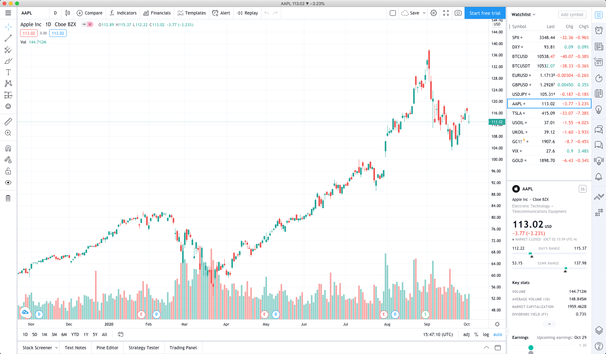

# Unofficial TradingView Desktop Version

Unofficial TradingView Desktop Version built with [Electron](https://www.electronjs.org)




# Features
* Block ads
* Block trial notification
* Refresh(F5 or Ctrl+R)
* Check for updates

# Solve the login failure problem
If the following situation occurs when you login

> You have been locked out due to too many login attempts. Please try again later.

you need to try the following steps:

* Click the menu on the top left
* Choose Home
* Choose your language
* Re-login

# How to build

* Install [Node.js](https://nodejs.org)

* Open Terminal / PowerShell / cmd

* Clone this repo

  ```bash
  git clone https://github.com/unknown-marketwizards/tradingview-desktop.git
  ```

* Enter folder

  ```bash
  cd tradingview-desktop
  ```

* Download electron

  ```bash
  npm install
  ```

* Build

  ```bash
  npm run build
  ```

---
